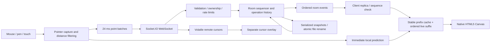

# Architecture

## Design goal

Keep shared drawing state deterministic and reviewable without a framework or drawing library. The server owns the room's total order; clients own rendering, input and temporary prediction. Operations are vectors, not transmitted bitmap tiles.

## Data flow



Plain-text equivalent: pointer input → local predicted rendering + batched WebSocket messages → validated synchronous room mutation → room event → client replica → cached-prefix/live-suffix drawing. Completed history → queued disk snapshot. Rejoin → complete room snapshot → replica replacement.

## Modules and state

`drawing-state.js` is a synchronous domain model without sockets or filesystem calls. A room holds an ordered operation array, redo ID stack, sequence counter, monotonic drawing order and point count. `rooms.js` owns asynchronous file I/O and lazy room loading; a pending-load map makes simultaneous first joins share one room instance. `server.js` translates events into mutations and emits only successful changes.

On the client, `websocket.js` handles connection status and acknowledgements. `main.js` checks event revisions, coordinates room/UI state and sends commands. `canvas.js` maintains the drawable replica, input buffers, optimistic operations and caches. Rendering code is shared by interactive drawing and PNG export.

An operation contains:

```js
{
  id, owner, order, kind, color, width, text,
  points: [{x, y}], done, hidden, batch
}
```

`owner` is the server-assigned Socket.IO connection ID. Each connection has at most one active operation. Imported operations receive new server-generated IDs and an `import` owner. Client IDs correlate prediction and authoritative events; they never authorize ownership.

## Conflict resolution and layering

The server assigns order when a valid **begin** arrives. Every client renders the same sequence of whole operations using the painter's algorithm. Later operations are above earlier ones, regardless of which participant finishes first. Coordinates are clamped to the fixed logical board and rounded to 0.1 px on both input and server validation.

Example: Alice starts a blue stroke, then Bob starts a red stroke over it. Red is on top even if Alice subsequently streams more points or finishes later. An eraser uses `destination-out` at its assigned position in the same composite. Thus Bob's later eraser also removes overlapping points arriving later on Alice's earlier stroke. A still-later brush can draw over the erased region. This is a deliberate whole-stroke ordering rule; it is not interleaving individual segments by network arrival.

Client prediction may briefly show a local operation above everything before its begin acknowledgement determines its order. Once the authoritative begin arrives, its predicted points substitute at the assigned array position. Prediction is removed on the authoritative end. During healthy streaming no visible rollback is required for local points. Invalid or uncertain writes trigger a snapshot rather than speculative retries.

## Global undo/redo strategy

1. A completed operation becomes an eligible history entry. Active strokes cannot be undone.
2. Undo selects the highest-order completed visible operation, sets `hidden=true`, and pushes its ID to a room-global redo stack. Anyone may request it.
3. Redo pops the shared stack and makes that operation visible again in its original order.
4. Any new operation completion clears redo. Abandoned undone operations stay hidden in storage, preserving stable identity but counting toward capacity.
5. Clear is a regular undoable operation that clears the composite at its position in history.
6. Import replaces the baseline and discards the undo stack after explicit UI confirmation, whole-document validation and a revision match. It is not an undoable operation.

"Latest" means highest **begin order among completed visible operations**, not latest wall-clock completion. A long-running earlier stroke does not jump above a later completed one. Undoing while another stroke is active affects only eligible completed entries. Concurrent undo requests run one after another in the Node event loop, so two requests undo two different entries; concurrent undo/redo is resolved by receipt order. This is intentional shared history, not per-user history or a CRDT.

Visibility changes invalidate the bitmap prefix cache and replay the vectors, so undoing an eraser restores the underlying marks correctly. No inverse-pixel operation is attempted. Disk snapshots preserve hidden entries and redo ordering across restarts; portable JSON exports contain only completed visible entries.

## Delivery and reconnection

Socket.IO preserves message ordering on a connection, but application-level delivery is not durable by default. Every room mutation emits a monotonically increasing `seq`. Each client applies only `seq == localSeq + 1`, ignores old events and requests a full snapshot on gaps. Joining emits a snapshot synchronously after membership is installed, before later room events can interleave with the state mutation. There is no async work inside drawing-state mutations.

Commands have six-second client acknowledgement timeouts. Point batches contain their own monotonically increasing per-stroke batch number; duplicates/gaps are rejected rather than accidentally appended. Commands are **not automatically retried**, especially global undo/redo. A timeout may mean the server already applied a command; resync reveals the authoritative outcome instead of applying it twice. This avoids pretending to provide exactly-once behavior.

Drawing is disabled while offline or resyncing. Connection retries use Socket.IO's randomized backoff, from 500 ms to five seconds. Rejoin obtains a complete snapshot, including other participants' active operations. Local speculative state is dropped. A sync request cancels that caller's uncertain active operation before returning the snapshot. Disconnect and room-switch cancel unfinished owned operations; inactive unfinished strokes expire after 30 seconds, checked every ten seconds. A hidden tab finishes its active stroke when possible.

Completed strokes survive in the live room and in persisted snapshots. Active strokes are transient: a network interruption can discard the unfinished stroke. This product choice is explicit in the UI/docs; no disconnected send queue or offline replay is used. Cursor traffic is volatile and expendable; cursor labels expire after five seconds without movement and on membership changes.

## Performance decisions

- **Logical coordinate space:** a fixed 1600 × 1000 board avoids viewport-specific drawing coordinates. Canvas backing resolution remains fixed rather than multiplying memory by device pixel ratio. CSS scales the display.
- **Event reduction:** coalesced pointer input is distance-filtered at 0.9 logical pixels; final endpoints are retained at 0.1 px. Coordinates are quantized. Brush rendering uses midpoint quadratic curves for smooth joins.
- **Batching:** pending points flush every 24 ms or at 128 points; pointer-up flushes before end. This amortizes JSON/event overhead while streaming before completion. Cursors send at most about 22 times per second.
- **Prediction:** local points draw on the next animation frame without waiting for the network. The optimistic version substitutes for its authoritative operation until completion.
- **Caching:** a hidden native canvas accumulates only the completed, unchanging prefix. Active operations and all later operations replay in order over that cache. Once the earliest active stroke finishes, the cache advances. Undo/cancel/import invalidate it. This protects eraser semantics while avoiding complete-history redraw on every normal point event.
- **Layering:** a separate transparent canvas draws cursor labels. Cursor updates do not replay drawing history. The artwork redraws only when dirty; the animation loop still samples FPS and updates cursor expiry.
- **Bounds:** message size is at most 5 MiB, point batches 128, strokes 4,096 points, room total 120,000 points/1,500 operations. A 120 events/sec per-socket token bucket with a 240-event burst rejects excess input. These are bounds, not a substitute for security controls.
- **Persistence:** complete snapshots are queued at roughly 800 ms intervals after history changes; write/rename operations serialize per room. Active point events do not trigger disk serialization. Empty rooms evict after five minutes; data remains on disk.

The design trades long-lived undo for memory. Full snapshots and prefix invalidation become expensive near the limits. Long concurrent strokes can keep a large suffix uncached. Tile-based invalidation, binary/delta encoding, a worker renderer and checkpoints are potential next optimizations; none are claimed as implemented.

## Persistence and failure boundaries

Each snapshot is captured synchronously before I/O is queued. A per-room promise chain prevents older writes finishing after newer writes. A failed write does not permanently poison the chain; later saves can retry. Existing valid files are only replaced after the temporary file write succeeds. Corrupt input on load is not silently overwritten. Shutdown closes sockets (canceling active operations), then saves rooms.

Acknowledging a drawing command means accepted in memory, not committed to disk. Autosave can lose about the debounce interval plus outstanding I/O on a crash. A successful explicit save confirms a file write/rename for the stated revision, not hardware-flushed durability. Concurrent drawing after that revision remains subject to subsequent autosave. A save that overlaps later activity must not be interpreted as a freeze of the board.

## Security and deployment scope

Only an allowlist of public client files is served. Room IDs cannot contain path separators. Incoming tools, widths, colors, point counts, coordinates, text lengths, owner IDs and import revisions are validated. Text/user names are inserted with `textContent` or drawn on Canvas, not interpreted as HTML. Imports are normalized rather than trusting saved sequence, owner or visibility fields.

Browser origins must match the HTTP host or the exact configured `ALLOWED_ORIGIN`. Native clients without Origin are allowed; this is not authentication. The CSP blocks third-party scripts and framing. Socket.IO serves its browser client from the same server. Rate limits are per connection only and do not stop distributed abuse. Add authentication, role checks for destructive history/import, connection/IP limits, storage quotas, logs and TLS for public use.

## Scaling toward 1,000 concurrent users

The included server is a single-process reference. Its room limit allows distributing 1,000 users across rooms, but no 1,000-user performance guarantee is made. The load script supports that experiment; run it against disposable infrastructure and observe real CPU, heap, event-loop lag, network egress and latency.

1. **Partition room ownership.** Consistently route each room to one authoritative worker. Keep mutation ordering local, or use an explicit leader/actor per room with fenced ownership. A generic Redis adapter broadcasts events but does not serialize this application's state.
2. **Separate transport from ownership.** Gateways can publish commands to a room owner and fan out accepted events through a broker. Use room revision offsets, idempotent command IDs, bounded outbound queues and forced resync for slow clients. The current implementation lacks explicit slow-consumer queue bounds beyond Socket.IO transport behavior.
3. **Durable history.** Replace JSON files with a transactional event log and periodic snapshots in database/object storage. Append accepted commands with a unique ID and room revision; commit before acknowledging if durable acceptance is required. Use leases/fencing during failover and replay events on reassignment.
4. **Manage fan-out.** Twenty-five users per room at 40 point batches/sec produce up to 25 × 40 × 24 = 24,000 peer deliveries/sec in a fully active room, before cursors. One thousand users in one room would produce about 40 million peer deliveries/sec at the same rate; the shipped 50-user room cap deliberately avoids that case. Aggregate points into server ticks, encode compactly, lower cursor frequency, and introduce viewport or interest-based subscriptions where appropriate.
5. **Keep render work bounded.** Checkpoint older committed layers and invalidate only affected tiles, move drawing into OffscreenCanvas workers where supported, or archive old undo history with an explicit product policy. Preserve the whole-operation order and eraser compositing semantics.
6. **Measure before increasing caps.** Start at 25/50/100 users spread across rooms, then 1,000. Measure p50/p95/p99 acknowledgement RTT, end-to-end paint latency, reconnect convergence, event-loop delay, heap, disk I/O and event drops. Load-test acknowledgements do not measure actual browser rendering or human stroke patterns.

See **PROTOCOL.md** for wire contracts and **TESTING.md** for reproducible checks.
